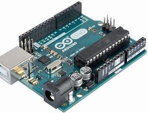
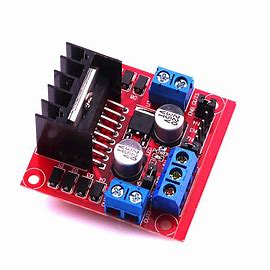
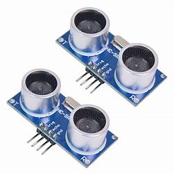
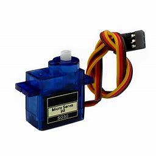
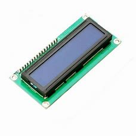
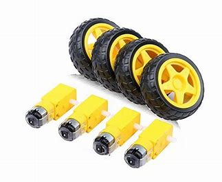

# Counter
Counter is a Obstacle Avoidance Robotic Vehicle. It uses two ultrasonic sensors to recieve reflected signals from the object in front and thus detects it.
To control two BO motors which are responsible for all the movement of the bot I have used L298N motor driver which recieves the signal from Arduino UNO in accordance with 
the object position. Then there is a LED display which gives the account of the two shapes (spherical and cuboidal) as calculated by the difference in values of the two ultrasonic sensors.

# Video

https://user-images.githubusercontent.com/82443192/177483648-44c90af7-c4f6-4fba-b8c6-9a68c00a0034.mp4

# Sensors and parts
 - **Arduino UNO** 
 
The Arduino Uno is an open-source microcontroller board based on the Microchip ATmega328P microcontroller and developed by Arduino.cc. The board is equipped with sets of digital and analog input/output (I/O) pins that may be interfaced to various expansion boards (shields) and other circuits. The board has 14 digital I/O pins (six capable of PWM output), 6 analog I/O pins, and is programmable with the Arduino IDE (Integrated Development Environment), via a type B USB cable. It can be powered by the USB cable or by an external 9-volt battery, though it accepts voltages between 7 and 20 volts.

 - **L298N Motor Driver** 
 
This L298N Motor Driver Module is a high-power motor 
driver module for driving DC and Stepper Motors. This 
module consists of an L298 motor driver IC and a 
78M05 5V regulator. L298N Module can control up to 4 
DC motors, or 2 DC motors with directional and speed 
control. I have used it for controlling the wheel motors.

 - **Ultrasonic Sensor** 
 
An ultrasonic sensor is an instrument that 
measures the distance to an object using 
ultrasonic sound waves.
An ultrasonic sensor uses a transducer to 
send and receive ultrasonic pulses that 
relay back information about an object’s 
proximity.

 - **Servo Motor** 
 
Servo control is a method of controlling many 
types of RC/hobbyist servos by sending the servo 
a PWM (pulse-width modulation) signal, a series 
of repeating pulses of variable width where 
either the width of the pulse (most common 
modern hobby servos) or the duty cycle of a 
pulse train (less common today) determines the 
position to be achieved by the servo. The PWM 
signal might come from a radio control receiver 
to the servo or from common microcontrollers such as the Arduino. I 
have used it to move ultrasonic sensors in 
90,180,0 degrees angle to detect obstacles.

 - **16x2 LCD Display Module** 
 
16×2 LCD is a 32 digits display screen for all kinds of CMOS/TTL devices. This word comes from the 
liquid crystal and 16X2 represents its screen size. In Liquid crystal display 16×2, there are 2 rows and 
16 columns. Besides, 5×8 pixel makes a single digit. Any digit from ASCII code is viewable on the 
module. It supports the custom signs and designs but those require some specific methods and have 
some limitations. This display module has too much use in most of the commercial projects and there 
is almost a library in every programming language about it. The premade libraries made it easy to 
interface with other devices.
I have used it to display no of object detected according to different shapes. Ex: cuboid – 7,sphere -5

 - **BO_Motors/Wheels** 
 
Bo motor (Battery Operated) lightweight DC geared 
motor which gives good torque and rpm at lower 
voltages. Here you can get BO motor with varying rated 
speed. This motor can run at approximately 200 rpm 
when driven by a single Li-Ion cell. Great for battery 
operated lightweightrobots. The motor has ability 
to operate with minimum or no lubrication, due to 
inherent lubricity. The motor is ideal for DIY enthusiasts. 
This motor set is inexpensive, small, easy to install, and 
ideally suited for use in a mobile robot car. They are 
commonly used in our 2WD platforms.

# Applications of Obstacle Avoidance Robotic Vehicle:

 - Especially military applications
 - It can be used for city wars
